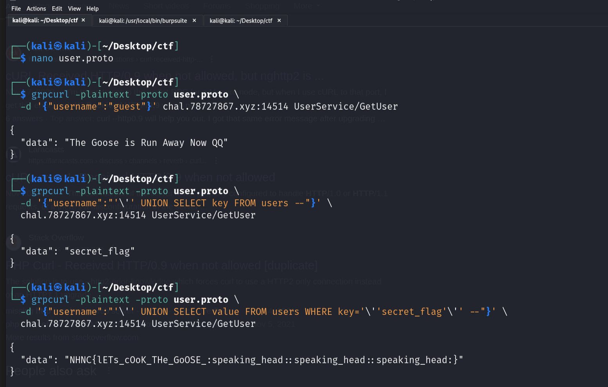

# Description


👀 secret\_flag or user\:admin

`Author: Frank`

`chal.78727867.xyz 14514 (Not nc)`

## server.py

```python
import grpc
from concurrent import futures
import user_pb2, user_pb2_grpc
import sqlite3

class UserService(user_pb2_grpc.UserServiceServicer):
    def __init__(self):
        self.conn = sqlite3.connect('ctf.db', check_same_thread=False)
        self.cursor = self.conn.cursor()

def serve():
    server = grpc.server(futures.ThreadPoolExecutor(max_workers=8))
    user_pb2_grpc.add_UserServiceServicer_to_server(UserService(), server)
    server.add_insecure_port('[::]:14514')
    server.start()
    server.wait_for_termination()

if __name__ == '__main__':
    serve()
```

**Source for grpc:**

[https://youtu.be/h8DDSRb\_Pt4?si=t6cKhIxvUdNDpSSC](https://youtu.be/h8DDSRb_Pt4?si=t6cKhIxvUdNDpSSC)
[https://www.youtube.com/watch?v=IVw8j3wXprM](https://www.youtube.com/watch?v=IVw8j3wXprM)


This means the gRPC server **does not expose reflection. Therefore, I** **cannot discover services or methods automatically and** **must know the service/method names** ahead of time, but yah I already got the source code from the author (server.py)

now I need to understand how grpc works. After watching tutorial and asking my “secret weapon”, here I have a proto file.

```proto
syntax = "proto3";

service UserService {
  rpc GetUser (UserRequest) returns (UserReply);
}

message UserRequest {
  string username = 1;
}

message UserReply {
  string data = 1;
}
```

Here is what we got.


